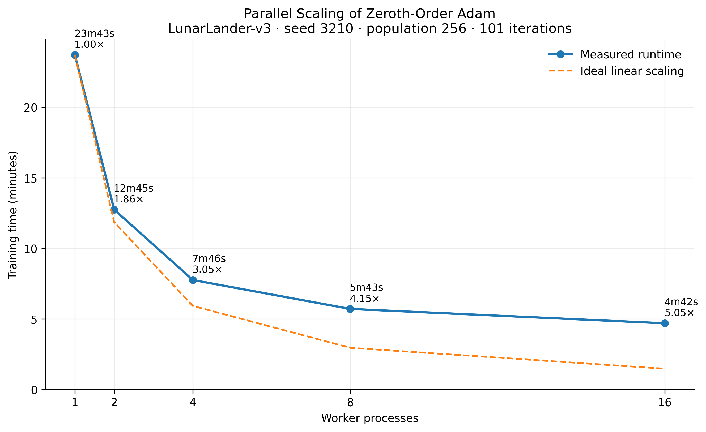
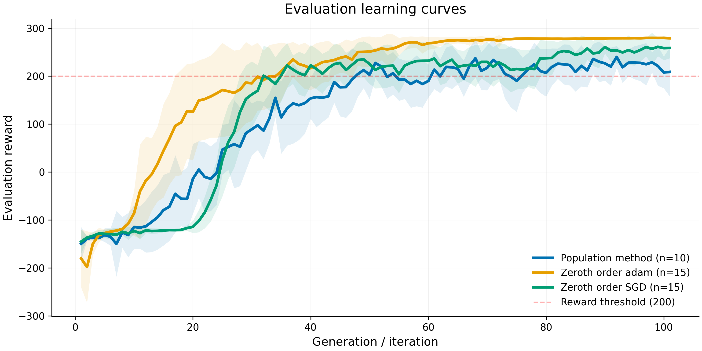

# Gradient-Free Reinforcement Learning for LunarLander-v3

Gradient-Free optimization methods are able to optimize a function without computing its gradient.
In RL, this means that they allow to improve a policy without having to compute the gradient of its parameters.

This project starts with a simple population-based method and then compares zeroth-order optimization using SGD and Adam. The Adam implementation also uses parallel rollouts to reduce training time.

## Environment

Experiments use the continuous version of Lunar Lander v3 [Gym Documentation](https://gymnasium.farama.org/environments/box2d/lunar_lander/), with episodes limited to 500 steps. Policies output the two continuous engine-control actions directly.

<p align="center">

<figcaption><small>The resulting .gif comes from a trained agent following population method.</small></figcaption>
</p>


## Methods

### Population method

The first approach uses a population of neural-network policies. At each generation, the best-performing policies are selected and used to produce a new population through parameter perturbations. This provides a simple gradient-free baseline before moving to zeroth-order gradient estimation.

#### Usage

```bash
# Default run
python population_method.py
# Select the training seed and device
python population_method.py --seed 5678 --device cuda
```

The default training seed is 1234 and the default device is CPU; CUDA is
optional and requires an available CUDA device. 

Each generation, the current parent policy is evaluated without exploration
noise on 5 fixed environment seeds, independent of the training seed. Each
run writes `generation,reward` CSV data (generation and evaluation reward) to
`results/population_method_seed-<seed>.csv`.


### Zeroth-order Optimization 

Zeroth-order optimization estimates an update direction from policy evaluations rather than backpropagating through the environment. For each Gaussian perturbation, the policy is evaluated at both $\theta+ \sigma \varepsilon$  and $\theta - \sigma \varepsilon$. Ranked rewards from these mirrored evaluations are then used to estimate how the policy parameters should move.

Both zeroth-order implementations use the same fixed perturbation scale and evaluation protocol. The main difference is how the estimated update is applied.

### Zeroth-order SGD

The SGD version applies the estimated zeroth-order update directly to the policy parameters. A fixed learning rate of $\alpha=4.0$ is used with a population of 128 perturbation directions.

Gaussian perturbations are used by default. An optional orthogonal Gaussian sampler is also included as an experimental variance-reduction strategy.

#### Usage

``` bash
# Default run
python zeroth_order_sgd.py
# Select the training seed and optional orthogonal Gaussian sampling
python zeroth_order_sgd.py --seed 5678 --sampling orthogonal
```


### Zeroth-order Adam

The Adam version uses the same zeroth-order gradient estimate but applies it with Adam instead of plain SGD. Adam adapts the update scale for each parameter and produces a smoother learning curve in these experiments.

The Adam experiment uses a larger population of 256 perturbation directions and evaluates them in parallel using worker processes.

#### Usage

``` bash
# Default run
python zeroth_order_adam_parallel.py
# Select the training seed and number of workers
python zeroth_order_adam_parallel.py --seed 5678 --workers 8
```

#### Parallel evaluation

Zeroth-order methods require many independent policy evaluations, which makes them well suited to parallel execution. Reusing a persistent pool of worker processes reduced the 101-iteration Adam experiment from 23m43s with one worker to 4m42s with 16 workers, corresponding to a 5.05× wall-clock speedup.

<p align="center">

</p>

## Experimental Settings

| Method | Framework | Population | Update | Learning rate | Noise / perturbation | 
|---|---|---:|---|---:|---:|
| Population method | PyTorch | 40 policies | Selection + mutation | — | 0.1 | 
| Zeroth-order SGD | JAX | 128 directions | SGD | 4.0 | σ = 0.5 | 
| Zeroth-order Adam | JAX | 256 directions | Adam | 0.15 | σ = 0.5 | 

## Results

The environment is considered solved if the agent scores at least 200 points.

The figure below shows the mean evaluation reward across independent training runs. Each trained policy is evaluated on the same five fixed environment seeds.

<p align="center">

</p>

All three methods eventually reach the 200-point reward. Zeroth-order Adam improves the fastest and reaches the highest average reward, stabilizing close to 280. Zeroth-order SGD also reaches the benchmark reliably, but with more variation between iterations. The population method learns more slowly and remains more variable, but still reaches successful policies.


<!-- Part of the rapid solution of the environment is due to the size of the population we use.

 -->


<!-- We included the standard deviation of the parent policy during evaluation. This allows us to observe the role played by the learning rate. Having a smoother progression with the Adam method.

 -->


## License

Distributed under the MIT License. See `LICENSE` for more information.

## Author

– [@Bortrex](https://github.com/Bortrex)
